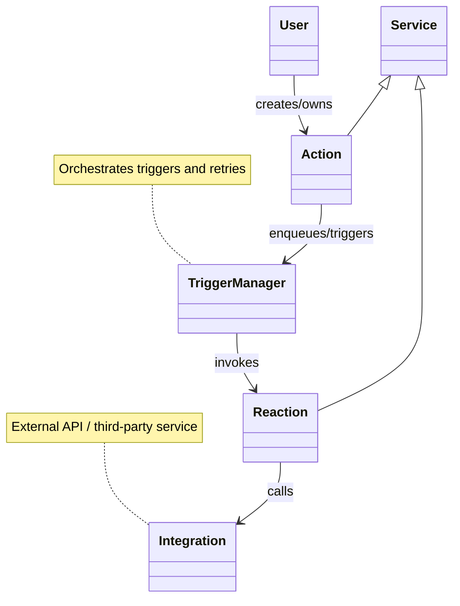
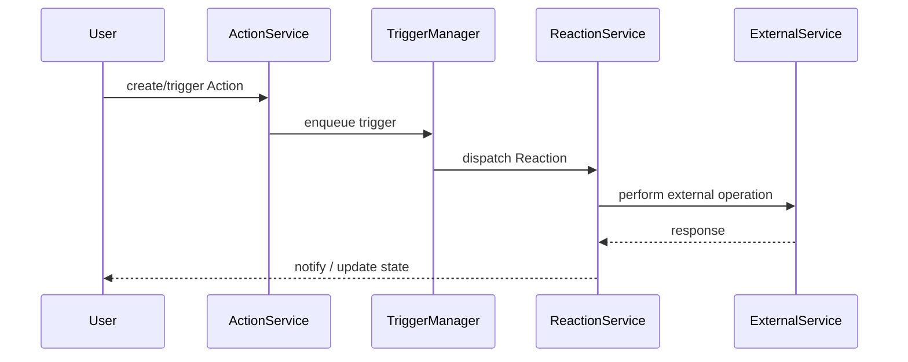

# Architecture Diagrams

This folder contains visual architecture diagrams for the project in Mermaid format. Use the diagrams to understand the relationships between Services, Actions, and Reactions, and the runtime flow when an Action triggers a Reaction.

Rendered Mermaid diagrams are embedded below for quick browsing.

## Class Diagram

## Sequence Diagram

